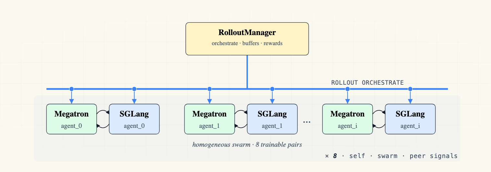
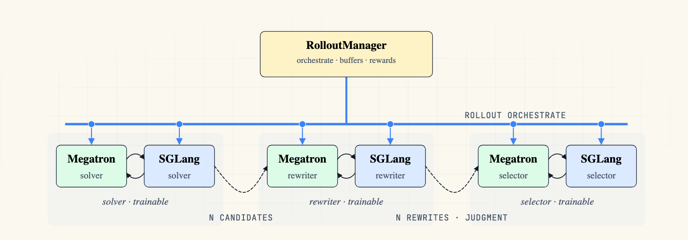

<div align="center">

# slime<sup>[n](https://github.com/slime-n/slime-n)</sup>

### A Multi-Policy, Multi-Agent RL Framework

### One config. Any mix of training, inference, and engines. From 1 policy to 100+.
</div>


slime<sup>n</sup> extends [slime](https://github.com/THUDM/slime) into a flexible multi-policy, multi-agent RL training framework.

Unlike most RL frameworks that assume a fixed structure — such as a single trainer or a hard-coded actor–critic setup — slime<sup>n</sup> takes a compositional approach: each run is defined as a list of components, freely assembled from three primitives:

- **Trainable policy pair**: a Megatron training actor paired with an SGLang rollout engine.
- **Standalone Megatron actor**: a Megatron-only component, either trainable or frozen.
- **Standalone SGLang engine**: an inference-only engine for frozen policies, reward models, judges, or verifiers.

 

With this unified schema, the same framework can support on-policy distillation, cooperative multi-agent RL, asymmetric PPO, reward-model serving, and other multi-policy workloads — without custom plumbing for each setup.


## Use Cases

Once **policy** is the unit of ownership — weights, optimizer, buffer, checkpoint — a wide class of multi-role RL systems becomes natural to express. The schema already covers:

| | |
|:---:|:---:|
|  |  |
| **OPD — Megatron teacher** | **OPD — SGLang teacher** |
|  |  |
| **Asymmetric PPO** (actor + critic) | **Solver + Summarizer** |
|  |  |
| **Multi-Agent Debate** | **Cooperative Swarm** |
|  | |
| **Multi-Agent** (solver + rewriter + selector) | |

*Each use case above composed from the three primitives.*

Natural extensions of the same primitives — actor + judge, actor + verifier + repair policy, red-team / blue-team, teacher cascades, ensemble critics, self-play, curriculum generators, specialist routing — fall out of the policy abstraction without new framework code.


## Features

- **`train_multi_policy.py`** — driver for n≥1 trainable policies. Replaces `train.py` for multi-policy runs.
- **YAML-driven configs** — `--config <path>.yaml`. Per-policy fields (parallelism, batching, optimizer, loss, paths, Megatron numerical / dropout, `log_probs_chunk_size`) live in the YAML; cluster sizing is derived from policies. See [`slime/utils/policy_config.py`](slime/utils/policy_config.py).
- **Per-policy buffers (split mode)** — each policy trains on its own samples, tagged via `Sample.policy_name`.
- **Per-policy weight sync** — serialized push from each Megatron actor to its paired sglang engine.

## Multi-Policy YAML Schema

Multi-policy runs are defined by a single YAML file passed with `--config`. The top-level `policies` list is the source of truth for the run composition: each entry declares one policy's identity, trainability, checkpoints, buffer routing, GPU slice, Megatron training settings, and optional SGLang engine settings. Policy names must be unique, and each paired policy gets a 1:1 SGLang server with the same name.

```yaml
policies:
  - name: solver
    role: actor
    trainable: true
    hf_checkpoint: /root/Qwen3-0.6B
    load: /ckpt/solver
    buffer_mode: split

    num_gpus_per_node: 1
    megatron_num_nodes: 1
    sglang_num_nodes: 1

    megatron:
      tensor_model_parallel_size: 1
      global_batch_size: 64
      lr: 1.0e-6
      advantage_estimator: grpo
      n_samples_per_prompt: 8

    sglang:
      num_gpus_per_engine: 1
      mem_fraction_static: 0.85

  - name: summarizer
    role: actor
    trainable: true
    hf_checkpoint: /root/Qwen3-0.6B
    load: /ckpt/summarizer
    buffer_mode: split

    num_gpus_per_node: 1
    megatron_num_nodes: 1
    sglang_num_nodes: 1

    megatron:
      tensor_model_parallel_size: 1
      global_batch_size: 64
      lr: 1.0e-6
      advantage_estimator: grpo
      n_samples_per_prompt: 8

    sglang:
      num_gpus_per_engine: 1
      mem_fraction_static: 0.85
```

The example above defines the solver+summarizer multi-policy run: `solver` generates 8 candidate solutions per prompt, and `summarizer` synthesizes a final answer over those candidates. Both policies use `n_samples_per_prompt: 8` so GRPO has a group of size 8 for advantage normalization on each side. Each trainable policy has its own paired Megatron actor and SGLang engine; both train on split buffers tagged via `Sample.policy_name`.

The `megatron:` block is flattened into the per-policy Megatron argument namespace, so parallelism, recompute, batching, optimizer, loss, KL, and OPD fields can differ by policy. The `sglang:` block is projected into the SGLang model/server config; `model_path` defaults to `hf_checkpoint`, and server arguments such as `mem_fraction_static`, `cuda_graph_bs`, and `max_total_tokens` are passed through.

Cluster sizing is derived from the YAML. Without `--colocate`, total GPUs are `sum(megatron_num_nodes * num_gpus_per_node) + sum(sglang_num_nodes * num_gpus_per_node)` across active policies. With `--colocate`, slime uses the larger of the Megatron and SGLang sides. A frozen standalone Megatron teacher sets `trainable: false` and `sglang_num_nodes: 0`.

## Examples

Three workloads exercise the multi-policy schema — two paired-pipeline cooperations (debate, solver+summarizer) and a frozen standalone Megatron actor (OPD teacher). Standalone SGLang engines (judge / reward model variants) are supported by the same schema; example pending.

### 1. Multi-Policy Multi-Agent debate — generator + critic

Two trainable paired policies implement a paper-aligned debate workflow. In round 0, N `generator` agents propose independent answers. In later rounds, an untracked summarize subroutine summarizes the other agents' previous responses, and each `critic` agent updates its own answer from that summary plus its own prior response.

Rewards are computed from the final critic responses: the system majority-votes a final answer `ŷ`; round-0 generator samples are rewarded for matching `ŷ`, and each critic trajectory receives reward 1 when that agent's final critic answer matches `ŷ`. The dataset gold label is intentionally ignored in this example.

Both `generator` and `critic` are trainable paired policies (Megatron + SGLang). The summarize step is routed through the generator SGLang engine, but its samples are not added to a training buffer. Code: [`examples/multi_policy_multiagent_debate`](examples/multi_policy_multiagent_debate).


*Paper-aligned debate on DAPO-math-17k, ground-truth label intentionally ignored. The ŷ majority vote over critic outputs is the only training signal; both generator and critic rewards rise round by round.*

### 2. Multi-Policy Solver + Summarizer — candidate generation + final answer synthesis

Two trainable paired policies cooperate on math problems. The `solver` policy generates N candidate solutions in parallel. The `summarizer` policy then sees all N solver candidates and synthesizes a final answer in the standard `Answer: \boxed{...}` format.

Both policies train on split buffers and receive direct RLVR correctness rewards on their own completions. The example also applies group reward shaping from the summarizer phase: if the mean summarizer reward is high, both roles are upweighted; otherwise both roles are downweighted.

Both `solver` and `summarizer` are trainable paired policies (Megatron + SGLang). Code: [`examples/multi_policy_solver_summarizer`](examples/multi_policy_solver_summarizer).


*Solver and summarizer trained together in a single run on DAPO-math-17k — each policy carries its own optimizer and buffer; both rewards rise jointly.*

### 3. OPD — on-policy distillation (student + frozen teacher)

Trainable **student** generates rollouts; frozen **teacher** runs forward-only on those rollouts and returns per-token logprobs that feed a reverse-KL term into the student's loss. The `student` is a standard trainable paired policy (Megatron + SGLang). The schema admits two teacher backends, both frozen:

- **Megatron teacher** — standalone Megatron actor, no SGLang engine. Recommended; its forward kernels match the student's training-time forward, keeping the KL noise floor low.
- **SGLang teacher** — standalone SGLang engine, no Megatron actor. Cheaper deployment and supports a larger teacher, at the cost of a small kernel mismatch on the KL term.

The teacher's `train()` returns `{"teacher_log_probs": ...}`. The driver merges all frozen-policy outputs into the student's `external_data`, which `train_actor` writes into `rollout_data` so `apply_opd_kl_to_advantages` can consume it.

Code: [`examples/multi_policy_opd_megatron`](examples/multi_policy_opd_megatron) (Megatron-backend teacher). The SGLang-backend variant uses the same schema; example pending.

### 4. PPO — asymmetric actor + critic

Trainable **actor** (Qwen3-1.7B) generates rollouts; trainable **critic** (Qwen3-0.6B) runs `train_critic` on those rollouts and emits per-token `values` that feed PPO advantages into the actor's loss. The critic is a standalone trainable Megatron actor (`m✓ s✗`) — no SGLang engine, just a value head. Per-policy `megatron_model_args` lets actor and critic differ in architecture, which legacy single-policy PPO cannot do (`train.py + --critic-config-path` ties them to the same CLI-global `MODEL_ARGS`).

Code: [`examples/multi_policy_ppo`](examples/multi_policy_ppo).

## Run

```bash
bash examples/multi_policy_two_agent/run-qwen3-0.6B-two-policy-two-agent.sh
```

Which boils down to:

```bash
ray job submit ... -- python3 train_multi_policy.py --config examples/multi_policy_two_agent/config.yaml
```

See [`train_multi_policy.py`](train_multi_policy.py) for the train-loop body and the architecture figure above (source: `../fig_arch_2.typ`) for the runtime layout.
