<div align="center">

# slime<sup>[n](https://github.com/slime-n/slime-n)</sup>

### A Multi-Policy, Multi-Agent RL Framework

### One config. Any mix of training, inference engines. From 1 policy to 100+.
</div>


slime<sup>n</sup> extends [slime](https://github.com/THUDM/slime) into a flexible multi-policy, multi-agent RL training framework.

Unlike most RL frameworks that assume a fixed structure — such as a single trainer or a hard-coded actor–critic setup — slime<sup>n</sup> takes a compositional approach: each run is defined as a list of components, freely assembled from three primitives:

- **Trainable policy pair**: a Megatron training actor paired with an SGLang rollout engine.
- **Standalone Megatron actor**: a Megatron-only component, either trainable or frozen.
- **Standalone SGLang engine**: an inference-only engine for frozen policies, reward models, judges, or verifiers.

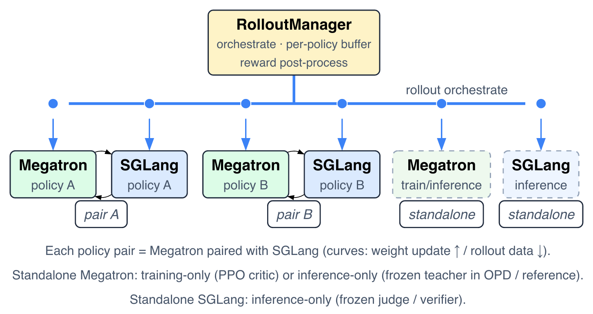 

With this unified schema, the same framework can support on-policy distillation, cooperative multi-agent RL, asymmetric PPO, reward-model serving, and other multi-policy workloads — without custom plumbing for each setup.


## Use Cases

Once **policy** is the unit of ownership — weights, optimizer, buffer, checkpoint — a wide class of multi-role RL systems becomes natural to express. The schema already covers three families, all composed from the same three primitives.

For each multi-agent use case below, the left figure is the **conceptual schema** (the data flow between roles) and the right figure is the **slime<sup>n</sup> framework** view (the Megatron / SGLang policy layout at runtime). PPO and OPD show the framework view only.

### 1. Asymmetric PPO

Actor and critic are separate policies, each with its own architecture, optimizer, and buffer — the critic a standalone Megatron value head with no SGLang engine. Code: [`examples/multi_policy_ppo`](examples/multi_policy_ppo).

| |
|:---:|
|  |
| **Asymmetric PPO** (actor + critic) |

### 2. On-policy Distillation

A trainable student paired with a frozen teacher that returns per-token logprobs for a reverse-KL term. The teacher runs on either backend. Code: [`examples/multi_policy_opd_megatron`](examples/multi_policy_opd_megatron) · [`examples/multi_policy_opd_sglang`](examples/multi_policy_opd_sglang).

| | |
|:---:|:---:|
| 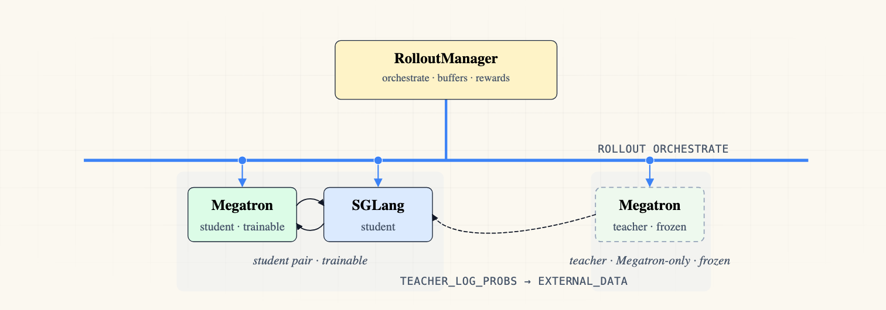 | 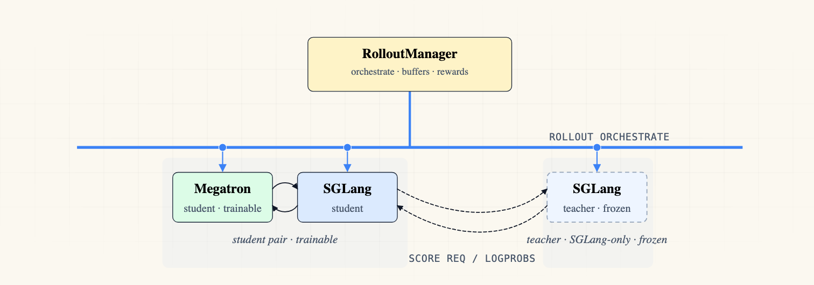 |
| **On-policy Distillation — Megatron teacher** | **On-policy Distillation — SGLang teacher** |

### 3. Multi-Agent Systems (Multiple policies)

Multiple trainable policies cooperating in a single run — debate, candidate generation + synthesis, cooperative swarms, generator/verifier loops, orchestrator + subagents, shared-state rounds, and staged solver pipelines.

**3.1 Consensus Debate**

N generator agents propose independent answers, then in later rounds each critic agent revises its own answer against a summary of the other agents' responses, with the majority-vote answer as the only training signal. Code: [`examples/multi_policy_consensus_debate`](examples/multi_policy_consensus_debate).

| schema | slime<sup>n</sup> |
|:---:|:---:|
| 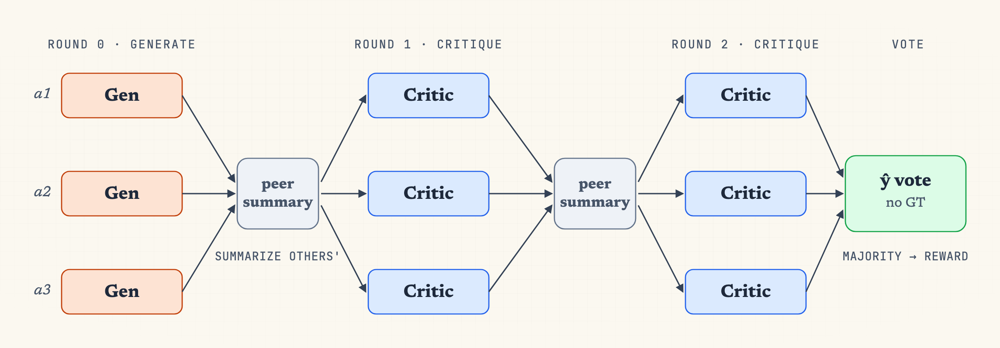 |  |

**3.2 Solver + Summarizer**

The solver generates N candidate solutions per prompt and the summarizer synthesizes them into a single final answer, with both policies trained jointly on their own correctness rewards plus group reward shaping. Code: [`examples/multi_policy_solver_summarizer`](examples/multi_policy_solver_summarizer).

| schema | slime<sup>n</sup> |
|:---:|:---:|
| 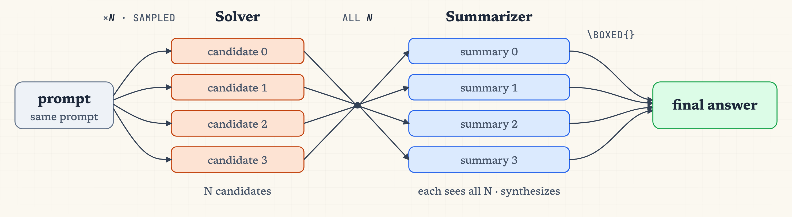 | 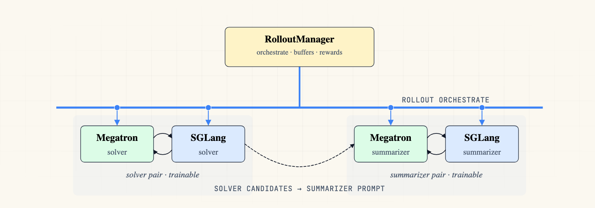 |

**3.3 Generator + Verifier**

The generator answers, the verifier critiques, and the generator revises with its round-1 answer carried forward — two trainable policies looping answer → critique → revise. Code: [`examples/multi_policy_generator_verifier`](examples/multi_policy_generator_verifier).

| schema | slime<sup>n</sup> |
|:---:|:---:|
| 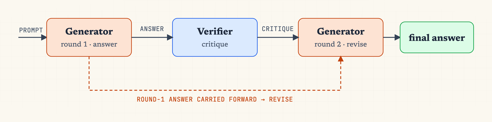 | 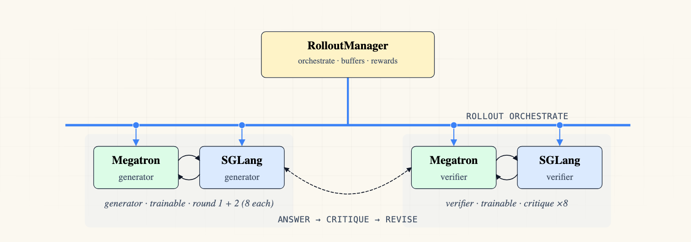 |

**3.4 Orchestrator + Subagents**

An orchestrator plans and dispatches the prompt to several subagents pursuing different approaches, then synthesizes their returned results into a final answer. Code: [`examples/multi_policy_orchestrator_subagent`](examples/multi_policy_orchestrator_subagent).

| schema | slime<sup>n</sup> |
|:---:|:---:|
| 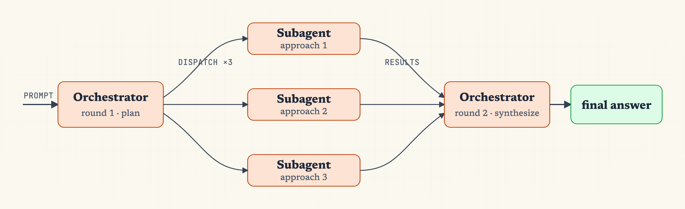 | 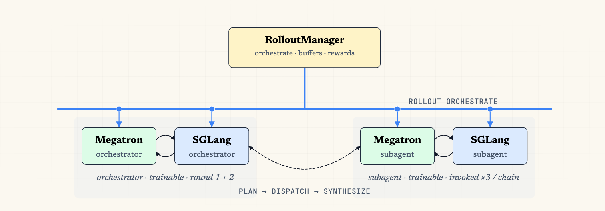 |

**3.5 Cooperative Swarm**

Eight independent agents answer the same prompt in parallel, blending a per-agent reward from self-GRPO, swarm EMA pass-rate, and peer ranking into a single advantage. Code: [`examples/multi_policy_exam_swarm`](examples/multi_policy_exam_swarm).

| schema | slime<sup>n</sup> |
|:---:|:---:|
|  |  |

**3.6 Shared-State Peers**

Two peers alternately read from and write to a versioned shared state across rounds, each round's updated state feeding both peers in the next. Code: [`examples/multi_policy_shared_state`](examples/multi_policy_shared_state).

| schema | slime<sup>n</sup> |
|:---:|:---:|
|  |  |

**3.7 Solver-Rewriter-Selector**

The solver emits N candidates, the rewriter refines them after seeing all N, and the selector picks the single best answer out of the N. Code: [`examples/multi_policy_solver_rewriter_selector`](examples/multi_policy_solver_rewriter_selector).

| schema | slime<sup>n</sup> |
|:---:|:---:|
| 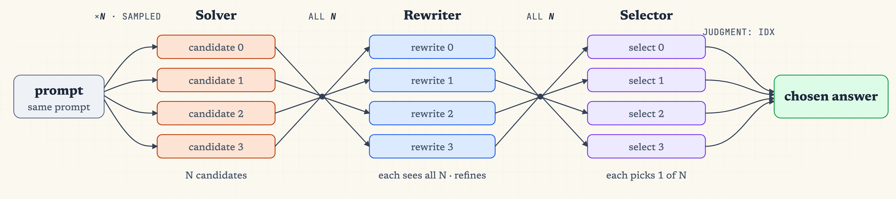 | 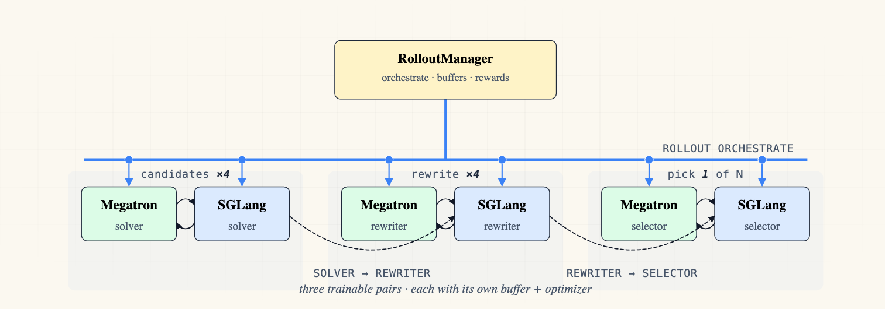 |

## Multi-Policy YAML Config

Multi-policy runs are defined by a single YAML file passed with `--config`. The top-level `policies` list is the source of truth for the run composition: each entry declares one policy's identity, trainability, checkpoints, buffer routing, GPU slice, Megatron training settings, and optional SGLang engine settings. Policy names must be unique, and each paired policy gets a 1:1 SGLang server with the same name.

```yaml
policies:
  - name: solver
    role: actor
    trainable: true
    hf_checkpoint: /root/Qwen3-0.6B
    load: /ckpt/solver
    buffer_mode: split

    num_gpus_per_node: 1
    megatron_num_nodes: 1
    sglang_num_nodes: 1

    megatron:
      tensor_model_parallel_size: 1
      global_batch_size: 64
      lr: 1.0e-6
      advantage_estimator: grpo
      n_samples_per_prompt: 8

    sglang:
      num_gpus_per_engine: 1
      mem_fraction_static: 0.85

  - name: summarizer
    role: actor
    trainable: true
    hf_checkpoint: /root/Qwen3-0.6B
    load: /ckpt/summarizer
    buffer_mode: split

    num_gpus_per_node: 1
    megatron_num_nodes: 1
    sglang_num_nodes: 1

    megatron:
      tensor_model_parallel_size: 1
      global_batch_size: 64
      lr: 1.0e-6
      advantage_estimator: grpo
      n_samples_per_prompt: 8

    sglang:
      num_gpus_per_engine: 1
      mem_fraction_static: 0.85
```

The example above defines the solver+summarizer multi-policy run: `solver` generates 8 candidate solutions per prompt, and `summarizer` synthesizes a final answer over those candidates. Both policies use `n_samples_per_prompt: 8` so GRPO has a group of size 8 for advantage normalization on each side. Each trainable policy has its own paired Megatron actor and SGLang engine; both train on split buffers tagged via `Sample.policy_name`.

The `megatron:` block is flattened into the per-policy Megatron argument namespace, so parallelism, recompute, batching, optimizer, loss, KL, and OPD fields can differ by policy. The `sglang:` block is projected into the SGLang model/server config; `model_path` defaults to `hf_checkpoint`, and server arguments such as `mem_fraction_static`, `cuda_graph_bs`, and `max_total_tokens` are passed through.

Cluster sizing is derived from the YAML. Without `--colocate`, total GPUs are `sum(megatron_num_nodes * num_gpus_per_node) + sum(sglang_num_nodes * num_gpus_per_node)` across active policies. With `--colocate`, slime uses the larger of the Megatron and SGLang sides. A frozen standalone Megatron teacher sets `trainable: false` and `sglang_num_nodes: 0`.

## Experimental Results

Two multi-agent cooperations trained on DAPO-math-17k. In both, every policy carries its own optimizer and split buffer, and rewards rise jointly.

**Consensus Debate** — generator + critic, with the ŷ majority vote over critic outputs as the only signal (gold label ignored). Code: [`examples/multi_policy_consensus_debate`](examples/multi_policy_consensus_debate).

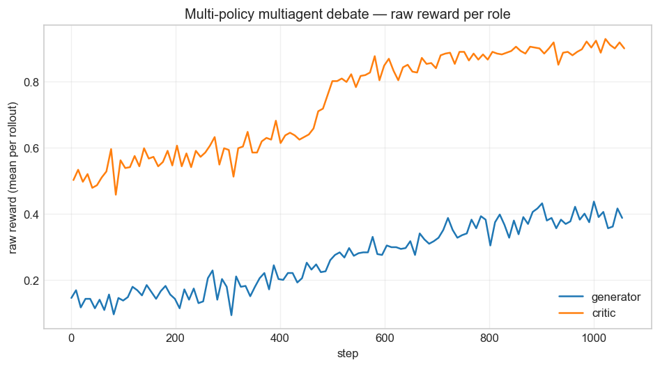

**Solver + Summarizer** — solver emits N candidates, summarizer synthesizes a final `\boxed{...}` answer; both get RLVR correctness rewards plus summarizer-phase group shaping. Code: [`examples/multi_policy_solver_summarizer`](examples/multi_policy_solver_summarizer).

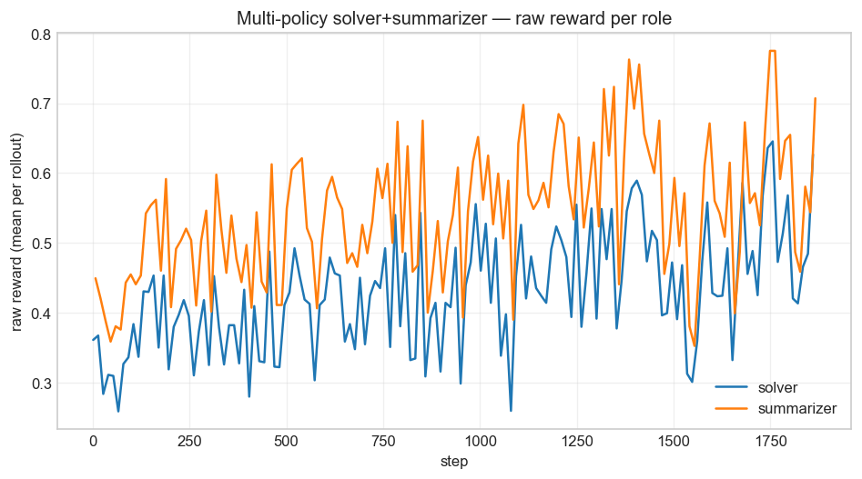


## Run

```bash
bash examples/multi_policy_two_agent/run-qwen3-0.6B-two-policy-two-agent.sh
```

Which boils down to:

```bash
ray job submit ... -- python3 train_multi_policy.py --config examples/multi_policy_two_agent/config.yaml
```

See [`train_multi_policy.py`](train_multi_policy.py) for the train-loop body and the architecture figure above (source: `../fig_arch_2.typ`) for the runtime layout.
