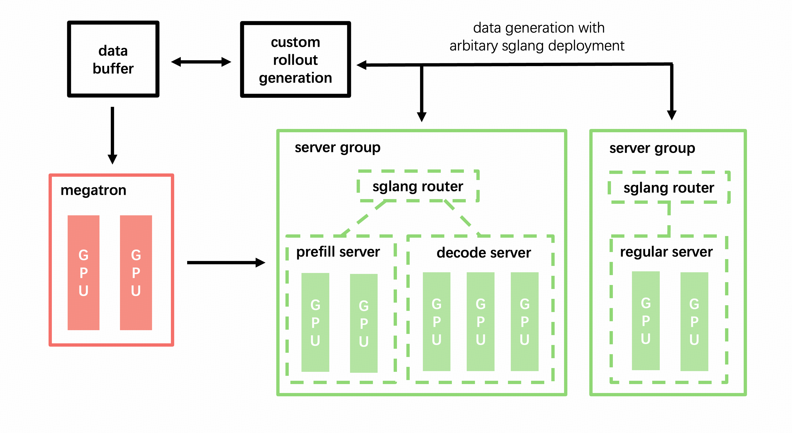

# SGLang Config：高级引擎部署

`--sglang-config` 是一个基于 YAML 的配置系统，用于在 slime 中精细控制 SGLang 引擎的部署。它支持**多模型服务**、**Prefill-Decode (PD) 分离**、**异构服务器组**，甚至可以作为复杂推理拓扑的**独立 SGLang 启动器**。

---

## 架构概览

在默认配置（不使用 `--sglang-config`）下，slime 部署单个模型，放在单个 router 后面，使用统一的服务器组：


使用 `--sglang-config` 后，SGLang 部署扩展为多模型、多 router 拓扑：



**核心设计原则：**

- **每个模型拥有独立的 router。** 模型在路由层隔离，支持独立的负载均衡和容错。
- **同一模型内的服务器组可以异构。** 不同组可以有不同的 TP 大小、worker 类型（prefill/decode/regular）和 SGLang server 参数覆盖。
- **权重同步按模型维度。** 只有 `update_weights: true` 的模型会接收来自训练的权重更新。冻结的模型（reference、reward 等）保持原样。

---

## 配置格式

配置文件是一个 YAML 文档，顶层 `sglang` 键包含一个模型定义列表：

```yaml
sglang:
  - name: <model_name>              # 必填。模型的唯一标识符。
    model_path: <path>              # 可选。HF checkpoint 路径。默认使用 --hf-checkpoint。
    update_weights: <bool>          # 可选。是否从训练同步权重。自动推断。
    num_gpus_per_engine: <int>      # 可选。该模型所有组的默认 TP 大小。
    server_groups:                  # 必填。服务器组配置列表。
      - worker_type: <type>         # 必填。可选：regular、prefill、decode、placeholder。
        num_gpus: <int>             # 必填。分配给该组的 GPU 总数。
        num_gpus_per_engine: <int>  # 可选。该组的 TP 大小覆盖。
        overrides: <dict>           # 可选。SGLang ServerArgs 字段覆盖。
```

### 字段参考

#### 模型级字段

| 字段 | 类型 | 默认值 | 说明 |
|------|------|--------|------|
| `name` | `str` | **必填** | 模型唯一名称（如 `"actor"`、`"ref"`、`"reward"`）。用作 `args.sglang_model_routers` 的 key。 |
| `model_path` | `str` | `args.hf_checkpoint` | HuggingFace checkpoint 路径。同一模型内的所有服务器组必须使用相同的 model path。 |
| `update_weights` | `bool` | 自动推断 | 该模型是否接收训练权重更新。未设置时自动推断：如果 `model_path` 与 `--hf-checkpoint` 匹配则为 `true`，否则为 `false`。 |
| `num_gpus_per_engine` | `int` | `args.rollout_num_gpus_per_engine` | 该模型服务器组的默认 TP 大小。各组可单独覆盖。 |
| `server_groups` | `list` | **必填** | `ServerGroupConfig` 条目列表，定义引擎拓扑。（`engine_groups` 作为向后兼容别名仍可使用。） |

#### 服务器组级字段

| 字段 | 类型 | 默认值 | 说明 |
|------|------|--------|------|
| `worker_type` | `str` | **必填** | 引擎类型：`regular`（标准）、`prefill`（PD prefill worker）、`decode`（PD decode worker）或 `placeholder`（占位，不启动引擎）。 |
| `num_gpus` | `int` | **必填** | 该组的 GPU 总数。必须 > 0。 |
| `num_gpus_per_engine` | `int` | 模型的 `num_gpus_per_engine` | TP 大小覆盖。每个引擎实例的 GPU 数量。 |
| `overrides` | `dict` | `{}` | SGLang `ServerArgs` 字段覆盖。优先级最高，覆盖 `--sglang-*` CLI 参数和模型级默认值。 |

### Worker 类型

| 类型 | 说明 | 使用场景 |
|------|------|----------|
| `regular` | 标准 SGLang 引擎 | 默认模式，同时处理 prefill 和 decode |
| `prefill` | PD 分离的 prefill worker | 专门处理 prompt；与 `decode` worker 配对 |
| `decode` | PD 分离的 decode worker | 专门生成 token；与 `prefill` worker 配对 |
| `placeholder` | 占位，不创建引擎 | 为训练共置预留 GPU 或留作未来使用 |

---

## 使用模式

### 1. 基本单模型部署

最简单的配置，复现默认行为：

```yaml
# sglang_basic.yaml
sglang:
  - name: default
    server_groups:
      - worker_type: regular
        num_gpus: 8
```

```bash
python train.py \
  --sglang-config sglang_basic.yaml \
  --rollout-num-gpus 8 \
  --rollout-num-gpus-per-engine 2 \
  ...
```

这将创建 4 个引擎（8 GPU ÷ 2 GPU/引擎），位于单个 router 之后。

### 2. PD 分离

将 prefill 和 decode 阶段分离到专用服务器组，以提升多轮和 agentic 场景的吞吐量：

```yaml
# sglang_pd.yaml
sglang:
  - name: actor
    server_groups:
      - worker_type: prefill
        num_gpus: 4
        num_gpus_per_engine: 2    # 2 个 prefill 引擎，TP=2
      - worker_type: decode
        num_gpus: 12
        num_gpus_per_engine: 4    # 3 个 decode 引擎，TP=4
```

```bash
python train.py \
  --sglang-config sglang_pd.yaml \
  --rollout-num-gpus 16 \
  ...
```

**为什么需要 PD 分离？** 在多轮场景中，prefill 和 decode 具有不同的计算特性。Prefill 是计算密集型（处理整个 prompt），而 decode 是内存带宽密集型（逐 token 生成）。分离它们可以：
- 为 prefill 使用更小的 TP（提高每 GPU 吞吐量）
- 为 decode 使用更大的 TP（降低延迟）
- 独立扩展 prefill 和 decode 的容量

> **注意：** PD 分离使用 SGLang Model Gateway (sgl-router)，并设置 `pd_disaggregation=True`。

### 3. 多模型服务

同时部署多个模型，每个模型拥有独立的 router：

```yaml
# sglang_multi_model.yaml
sglang:
  - name: actor
    update_weights: true              # 接收训练权重更新
    server_groups:
      - worker_type: regular
        num_gpus: 8
        num_gpus_per_engine: 4

  - name: ref
    model_path: /path/to/ref_model    # 不同的模型 checkpoint
    update_weights: false              # 冻结，不更新权重
    server_groups:
      - worker_type: regular
        num_gpus: 4
        num_gpus_per_engine: 2

  - name: reward
    model_path: /path/to/reward_model
    update_weights: false
    server_groups:
      - worker_type: regular
        num_gpus: 4
        num_gpus_per_engine: 2
```

```bash
python train.py \
  --sglang-config sglang_multi_model.yaml \
  --rollout-num-gpus 16 \
  --hf-checkpoint /path/to/actor_model \
  --rollout-function-path my_rollout.generate_rollout \
  ...
```

**在自定义 rollout 函数中访问模型：**

```python
from slime.rollout.sglang_rollout import get_model_url
from slime.utils.http_utils import post

async def my_generate(args, sample, sampling_params):
    # 路由到 actor 模型（默认）
    actor_url = get_model_url(args, "actor", "/generate")
    output = await post(actor_url, {"text": sample.prompt, "sampling_params": sampling_params})
    
    # 路由到 reference 模型
    ref_url = get_model_url(args, "ref", "/generate")
    ref_output = await post(ref_url, {"text": sample.prompt, "sampling_params": sampling_params})
    
    # 路由到 reward 模型（如 OpenAI 兼容 API）
    reward_url = get_model_url(args, "reward", "/v1/chat/completions")
    reward_output = await post(reward_url, {...})
    
    ...
```

`get_model_url()` 从 `args.sglang_model_routers`（一个将模型名称映射到 `(ip, port)` 元组的字典）中读取，该字典在引擎启动后自动填充。

### 4. 多模型 + PD 分离

将多模型与 PD 分离结合，实现最大灵活性：

```yaml
# sglang_full.yaml
sglang:
  - name: actor
    update_weights: true
    server_groups:
      - worker_type: prefill
        num_gpus: 4
        num_gpus_per_engine: 2
      - worker_type: decode
        num_gpus: 8
        num_gpus_per_engine: 4

  - name: ref
    model_path: /path/to/ref_model
    update_weights: false
    server_groups:
      - worker_type: regular
        num_gpus: 4
        num_gpus_per_engine: 2
```

### 5. 占位组用于 GPU 预留

使用 `placeholder` 组来预留 GPU 而不创建引擎。这在共置训练场景中很有用，部分 GPU 需要为训练预留：

```yaml
sglang:
  - name: actor
    server_groups:
      - worker_type: regular
        num_gpus: 6
        num_gpus_per_engine: 2
      - worker_type: placeholder
        num_gpus: 2                   # 预留 2 个 GPU（不创建引擎）
```

### 6. 按组覆盖 ServerArgs

使用 `overrides` 将 SGLang `ServerArgs` 字段应用到特定服务器组，而不影响其他组：

```yaml
sglang:
  - name: actor
    server_groups:
      - worker_type: regular
        num_gpus: 8
        num_gpus_per_engine: 4
        overrides:
          mem_fraction_static: 0.85
          context_length: 32768
          chunked_prefill_size: 4096
          enable_torch_compile: true
```

覆盖具有**最高优先级**，会覆盖基础的 `--sglang-*` CLI 参数和模型级默认值。这对以下场景特别有用：
- 不同组使用不同的内存配置
- prefill 和 decode 使用不同的 context length
- 在特定组上启用实验性功能

### 7. 独立 SGLang 启动器

虽然 `--sglang-config` 是为 slime 的训练流水线设计的，但它也可以作为纯推理场景的强大启动器，通过 `--rollout-external` 模式或配置 slime 仅关注推理服务。

**使用预启动的外部引擎：**

对于复杂的生产部署，你可能希望独立预启动 SGLang 引擎，然后将其连接到 slime：

```bash
# 步骤 1：外部启动 SGLang 引擎
python -m sglang.launch_server --model-path /path/to/model --port 10090 ...
python -m sglang.launch_server --model-path /path/to/model --port 10091 ...

# 步骤 2：将 slime 连接到外部引擎
python train.py \
  --rollout-external \
  --rollout-external-engine-addrs host1:10090 host2:10091 \
  ...
```

> **注意：** `--sglang-config` 和 `--rollout-external` 互斥。当你希望 slime 管理完整的引擎生命周期时，使用 `--sglang-config`；当引擎已预部署时，使用 `--rollout-external`。

---

## Router 配置

每个模型都有独立的 router（默认使用 SGLang Model Gateway）。

### Router 策略

你可以配置路由策略：

```bash
--router-policy round_robin        # 简单轮询
--router-policy consistent_hashing  # 多轮会话亲和
--router-policy cache_aware         # 缓存感知路由（默认）
```

### 多轮 Agent 的会话亲和路由

对于多轮对话和 agentic 场景，会话亲和确保同一对话的所有请求路由到同一个 backend worker。这可以显著提升 prefix cache 命中率，因为 worker 已经缓存了对话历史。

slime 自动为每个 sample 分配一个唯一的 `session_id`（存储在 `sample.session_id` 中）。当 router 策略为 `consistent_hashing` 时，该 ID 通过 `X-SMG-Routing-Key` header 传递，SGLang Model Gateway 使用它将同一会话的所有轮次确定性地路由到同一个 worker。

```bash
--router-policy consistent_hashing
```

**工作原理：**

1. 每个 sample 通过 UUID 分配唯一的 `session_id`
2. 每次请求时，slime 在 HTTP header 中传递 `X-SMG-Routing-Key: <session_id>`
3. SGLang Model Gateway 的 consistent hashing 策略将该 key 映射到特定的 worker
4. 后续轮次复用相同的 `session_id`，确保命中同一个 worker

---

## 解析规则

加载配置时，slime 按以下优先级顺序解析：

1. **每引擎 GPU 数回退：** 组 `num_gpus_per_engine` → 模型 `num_gpus_per_engine` → `args.rollout_num_gpus_per_engine`
2. **模型路径回退：** 组 `overrides.model_path` → 模型 `model_path` → `args.hf_checkpoint`
3. **权重更新推断：** 如果 `update_weights` 未设置：
   - 如果有效的 model path 与 `--hf-checkpoint` 匹配，则为 `true`
   - 否则为 `false`（会有警告）
4. **GPU 总数校验：** 所有模型所有组的 `num_gpus` 总和必须等于 `--rollout-num-gpus`。

---

## 互斥

`--sglang-config` 与以下选项互斥：

| 选项 | 冲突原因 |
|------|----------|
| `--prefill-num-servers` | PD 分离通过 YAML 中的 `server_groups` 配置 |
| `--rollout-external` | 外部引擎有自己的拓扑；config 在内部管理生命周期 |

---

## 完整示例：多模型 Agentic 训练

下面是一个完整的示例，展示在 32 个 GPU 上使用 PD 分离进行多模型 agentic RL 训练：

**配置文件 (`sglang_agent.yaml`)：**

```yaml
sglang:
  - name: actor
    update_weights: true
    server_groups:
      - worker_type: prefill
        num_gpus: 4
        num_gpus_per_engine: 2
        overrides:
          chunked_prefill_size: 8192
      - worker_type: decode
        num_gpus: 12
        num_gpus_per_engine: 4
        overrides:
          mem_fraction_static: 0.88

  - name: ref
    model_path: /data/models/Qwen3-32B
    update_weights: false
    server_groups:
      - worker_type: regular
        num_gpus: 8
        num_gpus_per_engine: 4

  - name: reward
    model_path: /data/models/reward-model
    update_weights: false
    server_groups:
      - worker_type: regular
        num_gpus: 8
        num_gpus_per_engine: 4
```

**启动命令：**

```bash
python train.py \
  --sglang-config sglang_agent.yaml \
  --hf-checkpoint /data/models/Qwen3-8B \
  --rollout-num-gpus 32 \
  --rollout-function-path my_agent.rollout.generate_rollout \
  --custom-rm-path my_agent.reward.reward_func \
  --advantage-estimator grpo \
  --n-samples-per-prompt 8 \
  ...
```

**自定义 rollout 函数 (`my_agent/rollout.py`)：**

```python
from slime.rollout.sglang_rollout import get_model_url
from slime.utils.http_utils import post

async def generate_with_models(args, sample, sampling_params):
    """使用 actor 生成，用 reward 模型打分，与 reference 比较。"""
    
    # 从 actor 生成
    actor_url = get_model_url(args, "actor", "/generate")
    actor_output = await post(actor_url, {
        "text": sample.prompt,
        "sampling_params": sampling_params,
        "return_logprob": True,
    })
    
    # 获取 reference logprobs 用于 KL penalty
    ref_url = get_model_url(args, "ref", "/generate")
    ref_output = await post(ref_url, {
        "text": sample.prompt + actor_output["text"],
        "sampling_params": {"max_new_tokens": 0, "temperature": 0},
        "return_logprob": True,
    })
    
    # 用 reward 模型打分
    reward_url = get_model_url(args, "reward", "/v1/chat/completions")
    reward_output = await post(reward_url, {
        "model": "reward",
        "messages": [{"role": "user", "content": sample.prompt + actor_output["text"]}],
    })
    
    # ... 处理输出并返回 Sample
```

---

## FAQ

### Q: 同一模型内可以混用 PD 和 regular 组吗？

不可以。PD 分离要求一个模型的服务器组要么全部是 prefill/decode 对，要么全部是 regular。不支持在同一模型内混用 `regular` 与 `prefill`/`decode`。

### Q: 如果 `num_gpus` 不能被 `num_gpus_per_engine` 整除怎么办？

对于跨节点引擎（`num_gpus_per_engine > num_gpus_per_node`），划分基于每节点的本地 GPU 数量。例如，每节点 8 个 GPU 且 `num_gpus_per_engine: 16` 时，每个引擎横跨 2 个节点。

### Q: 同一模型内的不同服务器组可以使用不同的 model path 吗？

不可以。同一模型内的所有服务器组必须共享相同的 `model_path`。这在 `resolve()` 时会被校验。如果需要不同的模型，请定义为独立的模型条目。

### Q: 运行时如何获取特定模型的 router 地址？

使用 `slime.rollout.sglang_rollout` 中的 `get_model_url(args, "model_name", "/endpoint")`。它从 `args.sglang_model_routers`（一个 `{ model_name: (ip, port) }` 字典）中读取，该字典在引擎启动后自动填充。

### Q: 可以不训练，只用 `--sglang-config` 做推理吗？

虽然 `--sglang-config` 是为 slime 的训练循环设计的，但你可以通过配置仅 rollout 的运行来实现纯推理场景。对于完全独立的 SGLang 推理服务，建议直接使用 SGLang 原生的 `launch_server`，或使用 `--rollout-external` 模式连接预部署的引擎。

### Q: `--sglang-config` 和 `--prefill-num-servers` 是什么关系？

`--prefill-num-servers` 是启用 PD 分离的旧方式（它创建一个带有 prefill + decode 组的单模型）。`--sglang-config` 是更新、更灵活的方式。两者互斥。我们推荐所有新部署迁移到 `--sglang-config`。
