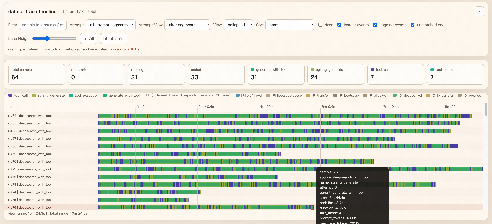

# Trace 可视化

slime 可以为每条 rollout sample 挂上轻量级执行 trace。它会记录生成、奖励模型等 span 事件，并且可以在保存下来的 rollout debug dump 中离线查看。



## 保存 rollout trace 数据

如果想在运行结束后查看 trace，可以在训练时打开 rollout debug dump：

```bash
python train.py \
    ... \
    --save-debug-rollout-data /path/to/debug/rollout_{rollout_id}.pt
```

每个保存出来的 `.pt` 文件都会包含 rollout samples，以及对应的 `trace` 数据。之后也可以通过 `--load-debug-rollout-data` 复用同一份 dump。

## 打开时间线查看器

对保存好的 rollout dump 运行：

```bash
python tools/trace_timeline_viewer.py /path/to/debug/rollout_0.pt
```

脚本会生成：

- `rollout_0.trace_timeline_cache.json`
- `rollout_0.trace_timeline_viewer.html`

默认情况下，它还会启动一个本地静态文件服务，方便直接在浏览器里打开。如果只想生成文件，可以加 `--no-serve`。

## 如何理解可视化结果

- 每一行对应一条 sample。
- 条形块表示 span，点表示瞬时事件。
- `trace_span(...)` 在开始和结束时记录的属性，都会显示在详情面板里。
- 当 SGLang 返回 PD 分离相关时延时，viewer 会自动补出 `[P]` 和 `[D]` 两条虚拟 lane，用来拆开展示 prefill/decode。
- 如果没有开启 PD，这两条虚拟 lane 不会出现，基础 trace 也仍然可以正常渲染。

## 给自定义代码打点

在自定义 rollout 或 reward 逻辑中，可以直接复用 `slime.utils.trace_utils` 里的工具：

- `trace_span(target, name, attrs=...)`：记录一段持续时间。
- `trace_event(target, name, attrs=...)`：记录一个瞬时事件。
- `trace_function(name, ...)`：用 decorator 把整个同步/异步函数包成一个 span。
- `bind_trace(sample)`：在 sample 被传递到其他 helper 或任务之前，确保它已经绑定好 trace carrier。

### `trace_span` 和 `trace_function` 的区别

如果你只想给函数内部的一小段逻辑打点，或者需要在代码块执行过程中补充 span 结束属性，就用 `trace_span(...)`。

如果整个函数调用都应该对应一个 span，就用 `trace_function(...)`。它本质上会先解析 trace target，然后在函数调用外层自动套一层 `trace_span(...)`，因此同步函数和异步函数都能直接用。

slime 主 rollout 流程里就是这样用的。例如 `generate_and_rm(...)` 按 sample 打点，而 `generate_and_rm_group(...)` 按 group 打点：

```python
from slime.utils.trace_utils import trace_function


@trace_function("generate_and_rm", target="sample")
async def generate_and_rm(args, sample, sampling_params, evaluation=False):
    ...


@trace_function(
    "generate_and_rm_group",
    target="group",
    attrs_getter=lambda args, group, sampling_params, evaluation=False: {"group_size": len(group)},
)
async def generate_and_rm_group(args, group, sampling_params, evaluation=False):
    ...
```

### 如何选择 target

`trace_function(...)` 需要一个 trace target，通常是 `Sample`、`TraceHandle` 或它们的列表。

- 如果 target 本来就是函数参数，优先写成 `target="sample"` 或 `target="group"`。
- 如果 target 需要从参数里推导出来，就用 `target_getter=...`。
- 不建议默认依赖自动推断。实现里确实可以从参数或当前 trace 上下文里推断 target，但显式写出来更稳定，也更不容易出现歧义。

### 给 decorator span 增加属性

如果想在 span 开始时附带属性，可以用 `attrs_getter=...`：

```python
@trace_function(
    "custom_rollout_batch",
    target="samples",
    attrs_getter=lambda samples, **_: {"batch_size": len(samples)},
)
async def custom_rollout_batch(samples, **kwargs):
    ...
```

如果你需要在函数执行到一半之后再补充属性，那么不要只靠 decorator，应该在函数内部再嵌一层 `trace_span(...)`。一个比较常见的模式是：

- 外层用 `trace_function(...)` 表示整个函数生命周期
- 内层用 `trace_span(...)` 标记 generation、RM、filter、post-process 等关键子步骤

如果想统一记录 SGLang 返回的 generation 元信息，可以复用 `build_sglang_meta_trace_attrs`：

```python
from slime.utils.trace_utils import build_sglang_meta_trace_attrs, trace_span

with trace_span(sample, "sglang_generate") as span:
    output = await post(url, payload)
    span.update(build_sglang_meta_trace_attrs(output["meta_info"]))
```

## 使用建议

- 先保存少量 rollout；单个 dump 的 sample 数量适中时，viewer 会更容易阅读。
- viewer 直接基于保存下来的 `.pt` dump 工作，因此可以把文件拷到别的机器离线分析。
- 如果你想看的是 SGLang 自身的 GPU / kernel 级 profiling trace，请参考 [性能分析](./profiling.md)。

