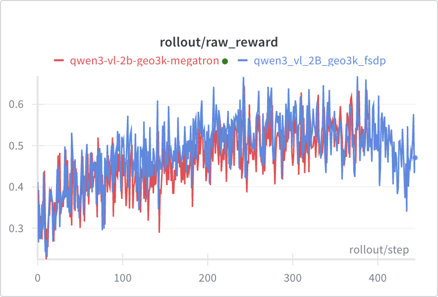

# VLM Single-Turn RL

Training VLMs with Megatron on single-turn reasoning task using GRPO on the [GEO3K dataset](https://huggingface.co/datasets/hiyouga/geometry3k). We used processed version [here](https://huggingface.co/datasets/chenhegu/geo3k_imgurl).

Supported models:
* Qwen2.5-VL
* Qwen3-VL (Dense and MoE)
* Qwen3.5 (Dense and MoE)

Note: Please make sure the cudnn version in the environment is 9.16.0.29 to prevent severe performance regression in conv3d in torch 2.9 mentioned in https://github.com/pytorch/pytorch/issues/168167. Otherwise, you can reinstall cudnn with:
```bash
pip install nvidia-cudnn-cu12==9.16.0.29
```

**Important:** We use [Megatron Bridge](https://github.com/NVIDIA-NeMo/Megatron-Bridge) to support multimodal models. However, not all Megatron arguments are passed through to Megatron Bridge — you may need to set some manually [here](https://github.com/THUDM/slime/blob/de84e10d468dcb726e1199fd6bd16aa9538aed09/slime/backends/megatron_utils/model_provider.py#L89) (currently only parallelization-related arguments are passed). For example, for Qwen3-VL-30B-A3B you may need to add:
```python
provider.moe_aux_loss_coeff = args.moe_aux_loss_coeff
provider.freeze_language_model = False
provider.freeze_vision_model = False
```

<p align="center">
  
</p>

## Data Preparation (For SFT Training)

The [geo3k_imgurl](https://huggingface.co/datasets/chenhegu/geo3k_imgurl) dataset contains:
- `problem`: The math problem text (string)
- `answer`: The answer (string, e.g., "270")
- `images`: Image data (list)

For SFT training, we need to format the `answer` field for `\boxed{}` format and the messages. You can use the following script to format the answer field:

```python
from datasets import load_dataset
import pandas as pd

ds = load_dataset("chenhegu/geo3k_imgurl", split="train")

def format_answer(answer: str) -> str:
    """Format answer to include \\boxed{} format."""
    return f"Answer: \\boxed{{{answer}}}"

def process_sample(sample):
    formatted_answer = f"Answer: \\boxed{{{sample['answer']}}}"
    
    sample["messages"] = [
        {"role": "user", "content": sample["problem"]},
        {"role": "assistant", "content": formatted_answer}
    ]
    return sample

ds = ds.map(process_sample)
ds.to_parquet("/root/datasets/geo3k_imgurl/train_formatted.parquet")
```

## Reproduce

```bash
export WANDB_API_KEY=your_wandb_api_key

# Megatron backend (default -> Qwen3-VL-8B-Instruct + Megatron)
./examples/geo3k_vlm/run_geo3k_vlm.sh

# With different model
SLIME_SCRIPT_MODEL_NAME=Qwen3-VL-4B-Instruct ./examples/geo3k_vlm/run_geo3k_vlm.sh

# SFT
./examples/geo_3k_vlm/run_geo3k_vlm_sft.sh
```

### Configuration

| Environment Variable | Default | Description |
|---------------------|---------|-------------|
| `SLIME_SCRIPT_MODEL_NAME` | `Qwen3-VL-8B-Instruct` | Model name |
| `SLIME_SCRIPT_DATASET_NAME` | `chenhegu/geo3k_imgurl` | HuggingFace dataset name |
| `SLIME_SCRIPT_NUM_GPUS` | `8` | Number of GPUs |
| `SLIME_SCRIPT_EXTERNAL_RAY` | `0` | Use external Ray cluster (`1` to enable) |

### Supported Models

- `Qwen3-VL-2B-Instruct`
- `Qwen3-VL-4B-Instruct`
- `Qwen3-VL-8B-Instruct`
- `Qwen3-VL-30B-A3B-Instruct`
- `Qwen3-VL-235B-A22B-Instruct`
- `Qwen3-VL-2B-Thinking`
- `Qwen3-VL-4B-Thinking`
- `Qwen3-VL-8B-Thinking`
- `Qwen3-VL-30B-A3B-Thinking`
- `Qwen3-VL-235B-A22B-Thinking`

#### Qwen3.5 Series
We provide an [example](./run_geo3k_qwen35.sh) for Qwen3.5-35B-A3B. To support other Qwen3.5 models, add a model config file in `scripts/models/` and update the model name and config path in the script accordingly.

Since Megatron does not currently support packing for GDN, you must set `--qkv-format bshd`, `--micro-batch-size 1`, and remove `--use-dynamic-batch-size`.

## Notes

### Reward Model Configuration

We experimented with three reward model configurations:
1. A geo3k-specific RM with tolerance=0.05 (to handle rounding in ground truth labels)
2. A geo3k-specific RM with tolerance=0.0 (strict matching)
3. The default math RM

All three performed similarly, so we use the default math RM for simplicity.

### Numerical Precision with Non-Binary Rewards

Our initial geo3k-specific verifier produced "format scores" (**0 and 0.9**) instead of clean binary rewards. Under **fp32**, fractional values like 0.9 can't be exactly represented, so when all samples in a group have the same reward, `reward - mean` doesn't equal zero—creating spurious gradient signal.

We fixed this by switching to the default math RM with clean **binary 0/1 rewards**. If you encounter similar precision issues with non-binary rewards, you can change the reward tensor dtype from `torch.float` to `torch.float16` in `slime/ray/rollout.py` (`_post_process_rewards` method) to truncate precision artifacts.

## B200
Blackwell currently does not support fa3, we need to use  `--sglang-mm-attention-backend sdpa` and `--attn-implementation flash_attention_2`
