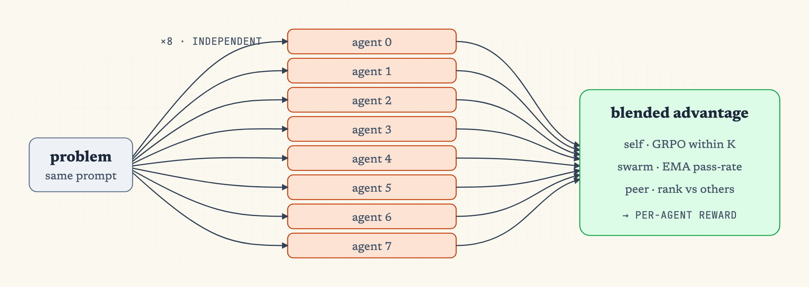

# Multi-Policy Exam Swarm RL

Train 8 homogeneous agents that independently solve the same math problems. Each agent's reward blends three signals: self-improvement (GRPO within its own K), swarm cooperation (EMA-baselined pass rate), and per-peer competition (rank vs other agents).

| schema | slime<sup>n</sup> |
|:---:|:---:|
|  |  |

*Left: 8 agents independently answer the same prompt; rewards combine intra-agent (`self`), swarm-wide (`swarm`), and pairwise (`peer`) signals. Right: 8 byte-identical trainable pairs sharing one rollout manager, each with its own Megatron + SGLang and training buffer.*

## Files

* `config.yaml`: 8 byte-identical paired policies (Megatron + sglang).
* `run-qwen3-0.6B-exam-swarm-colocate.sh`: 8-GPU single-node colocate launch.
* `agent_system.py`: 3-channel advantage composition, ALPHA/BETA/GAMMA knobs, `BASELINE_MODE`.
* `rollout_with_swarm.py`: slime `--custom-generate-function-path` entrypoint.

## Quick Start

```bash
cd slime-n
bash examples/multi_policy_exam_swarm/run-qwen3-0.6B-exam-swarm-colocate.sh
```

8 GPUs, single node. Each GPU hosts one agent's Megatron + sglang (offload-swap between phases).

## Reward

Per outer prompt: 8 agents each generate K=8 answers (64 trajectories). RLVR scores them. Then for each trajectory:

```text
final = α · self_adv + β · swarm_adv + γ · peer_adv     (clipped to ±5)

self_adv  = (c - mean_K) / std_K                  # GRPO mode
            (c - max_peer_mean) / std_K           # adversarial mode
swarm_adv = (g - μ_g) / σ_g                       # g = swarm pass rate this question
                                                   # μ_g, σ_g = EMA over past questions
peer_adv  = (N + 1 - 2·rank_i) / (N - 1)          # zero-mean across agents
```

Stored as `Sample.reward`. The run script passes `--disable-rewards-normalization` so slime doesn't re-normalize it.

## Knobs (`agent_system.py`)

| Constant | Default | Role |
|---|---|---|
| `ALPHA` | 0.5 | individual self_adv weight |
| `BETA` | 0.3 | cooperative swarm_adv weight |
| `GAMMA` | 0.2 | competitive peer_adv weight |
| `BASELINE_MODE` | `"grpo"` | `"grpo"` (self-comparison) or `"adversarial"` (vs best peer) |
| `N_AGENTS` | 8 | must match `policies` count in `config.yaml` |

The γ/β ratio is the cooperative-competitive dial. `BASELINE_MODE="adversarial"` strengthens competition further.
