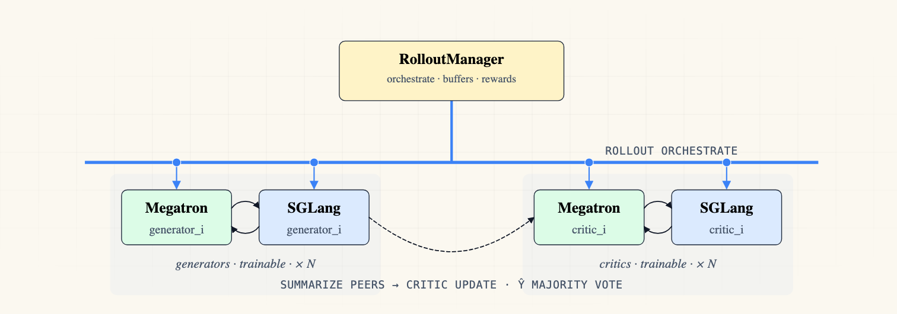

# Multi-Policy Multi-Agent Debate (generator + critic)

Paper-aligned implementation of [Subramaniam et al. 2025, "Multiagent Finetuning of Language Models"](https://arxiv.org/abs/2501.05707) Algorithm 1, on math problems (DAPO-math-17k). N=3 generator agents propose initial answers; in subsequent rounds an untracked summarize subroutine summarizes the OTHER agents' previous responses, and each critic agent updates its own answer from that summary. The dataset's ground-truth label is **intentionally ignored** — rewards come from a majority vote over the agents' own final critic responses (the paper's self-improvement-without-ground-truth setup).

| schema | slime<sup>n</sup> |
|:---:|:---:|
|  |  |

*Left: round-0 generators propose answers, then each critic revises from a summary of the other agents' previous answers; final rewards come from a ŷ majority vote over critic outputs — no ground-truth label. Right: N trainable generator pairs + N trainable critic pairs (the paper sets N=3), each Megatron + SGLang.*

## Files

* `config.yaml`: generator + critic policy schema (both trainable, paired with their own SGLang engines).
* `run-qwen3-0.6B-multiagent-debate.sh`: launch script (ray start + train_multi_policy.py).
* `agent_system.py`: paper-aligned debate orchestration (round 0 generators, summarize subroutine, critic rounds, ŷ majority vote, reward propagation).
* `rollout_with_multi_agents.py`: top-level multi-agent rollout entrypoint.
* `prompts.py`: generator / summarize / critic prompt templates.

## Quick Start

```bash
cd slime-n
bash examples/multi_policy_multiagent_debate/run-qwen3-0.6B-multiagent-debate.sh
```

## How It Works

* Pipeline per prompt (N=3 agents, M=3 rounds):
  * **m=0**: N parallel generators (`A^G`) propose initial responses → trained as `generator`.
  * **m=1..M-1**: for each agent i, an untracked summarize step (paper's `A^S`, routed through the generator engine but NOT trained as a separate policy) summarizes the OTHER N-1 agents' round-(m-1) responses; agent i then runs a critic step on summary + its own prior response → trained as `critic`.
* Reward (Algorithm 1 lines 23-26):
  * `ŷ` = majority vote over the FINAL critic responses (per prompt).
  * **generator** (round 0): `1` if its boxed answer = ŷ, else `0`.
  * **critic** (any round): trajectory-level — `1` if THIS agent's FINAL critic response = ŷ, propagated to all of that agent's critic rounds.


## Results

1062-step run on Qwen3-0.6B.

**Per-role raw reward** — both policies trend up as agents converge.
The critic's reward is consistently higher (mean ~0.74, max ~0.93)
because trajectory-level scoring credits every critic round when the
agent's FINAL response matches the majority vote ŷ; the generator
only gets reward on its single round-0 boxed answer (mean ~0.27,
max ~0.44). The visible inflection around step 450 — critic jumps
~0.6 → ~0.85 — is the moment agents stably converge to a shared
answer in the late critic rounds.


