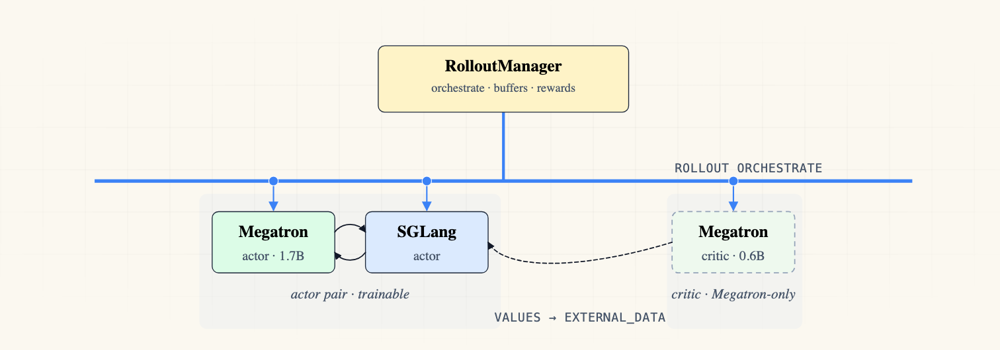

# Multi-Policy PPO (asymmetric actor + critic)

Multi-policy PPO with a **smaller critic than actor**: a 1.7B trainable **actor** generates rollouts; a 0.6B trainable **critic** runs `train_critic` (forward + value-loss + backward) on those rollouts and emits per-token `values` that feed PPO advantages into the actor's loss. Because the critic is its own Megatron Ray actor (separate weights, separate optimizer, separate GPU), it can be a different architecture from the actor — the use case legacy single-policy PPO (`train.py + --critic-config-path`) cannot express.



*A trainable **actor** pair (Megatron + SGLang) and a trainable **critic** standalone Megatron actor (no engine). The critic emits per-token `values` into the actor's PPO loss via `external_data`.*

## Files

* `config.yaml`: actor (Qwen3-1.7B, paired) + critic (Qwen3-0.6B, standalone) policy schema.
* `run-qwen3-1.7B-0.6B-ppo.sh`: launch script (ray start + train_multi_policy.py).

## Quick Start

```bash
cd slime
bash examples/multi_policy_ppo/run-qwen3-1.7B-0.6B-ppo.sh
```

Place a Qwen3-1.7B HF checkpoint at `/root/Qwen3-1.7B`, a Qwen3-0.6B HF checkpoint at `/root/Qwen3-0.6B`, and `dapo-math-17k.jsonl` at `/root/dapo-math-17k/`.

## How It Works

* **Critic dispatch.** The critic is shape-derived: `trainable + sglang_num_nodes == 0 + advantage_estimator == "ppo"` → `is_critic_shape(cfg)` returns True. `placement_group.py`'s `create_training_models_multi` derives `role_eff="critic"` for it and passes that to `allocate_train_group` and `async_init`. The model_provider then attaches a 1-dim value head (`LinearForLastLayer`) on the critic, and `actor.__init__` skips `weight_updater` / `weights_backuper` setup.
* **Asymmetric architecture.** Per-policy arch flags (`num_layers`, `hidden_size`, `ffn_hidden_size`, …) live inline inside each policy's `megatron:` block. The parser auto-captures any key that isn't a declared `PolicyConfig` field into `PolicyConfig.extra_megatron_args`, and `config_to_namespace` projects those onto the per-policy `args` namespace — overriding CLI-derived `MODEL_ARGS`. The actor sees the 1.7B arch; the critic sees the 0.6B arch.
* **Train order.** The driver partitions handles by shape into `frozen / trainable_standalone / trainable_pair`. The critic lands in `trainable_standalone` (no engine) and runs before the actor every rollout. Its `{"values": ...}` return value merges into `merged_external` and reaches the actor as `external_data`.
* **Advantage merge.** `train_actor` (`actor.py:509-515`) folds `external_data["values"]` into `rollout_data["values"]` on the actor's last PP rank, gated on `args.use_critic` (which the driver flips True on the actor's namespace when any sibling is critic-shaped — before `register_policy` snapshots the args). `compute_advantages_and_returns` then sees the critic-provided values when computing PPO advantages for the actor.
* **Weight push.** Refined gate `cfg.trainable and has_sglang_engine(cfg)` skips the critic (no engine to push to).

## Compared to legacy single-policy PPO

`train.py + --critic-config-path` ties actor and critic to the same CLI-global `MODEL_ARGS`, forcing them to share architecture. Multi-policy PPO lifts that constraint via per-policy `extra_megatron_args`, enabling:

- A **smaller critic** (1.7B + 0.6B as shown here) — saves a GPU's worth of value estimation without throttling the actor's rollout engine.
- A **larger critic** for harder value-estimation problems — same plumbing, different YAML.

## Known limitations (v1)

- **TP/PP/CP/DP must match between actor and critic.** `external_data["values"]` is routed per-rank via the driver's `list[dict]` pass-through, so the producer's effective DP world (non-empty last-PP-stage ranks, in DP order under Megatron's default `tp-cp-ep-dp-pp` mesh) must equal the consumer's `world_size`. v1's example uses 1 GPU on each side, which satisfies this trivially.
- **Cold-start critic.** Conventional PPO critics initialize from the actor's weights with a value head bolted on; that's impossible with asymmetric architecture. The critic loads from its own (smaller) base LM checkpoint, so expect a flat-then-rising critic loss for the first many rollouts and weak advantages on the actor side until the critic warms up.
