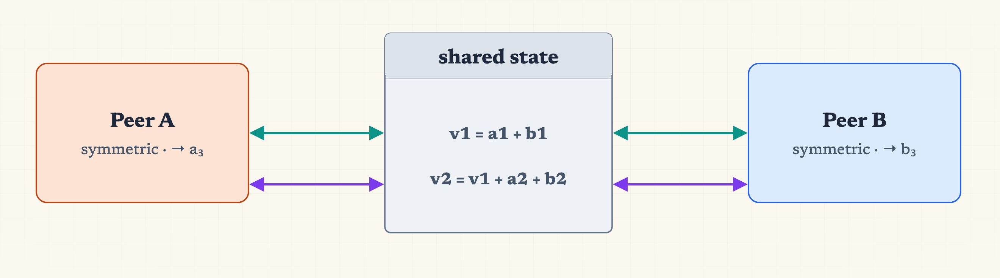
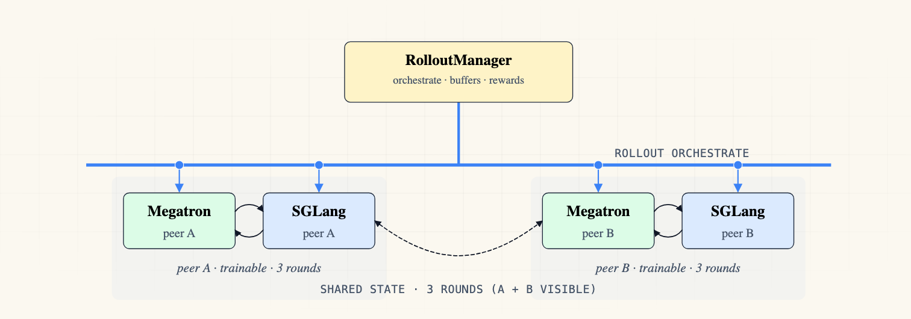

# Multi-Policy Shared State

This example trains two symmetric peer policies on a shared-state math chain.

| schema | slime<sup>n</sup> |
|:---:|:---:|
|  |  |

*Left: two symmetric peers alternately read and write a versioned shared state across 3 rounds (v1 = a1+b1, v2 = a1+b1+a2+b2), each round's state feeding both peers in the next. Right: two trainable peer pairs (Megatron + SGLang), each with its own buffer.*

Both peers are structurally identical and trainable. No hierarchy, no coordinator
role. The shared state is passive prompt stitching: each round's prompt includes
think-stripped visible responses from all prior rounds.

## Reward

- `peer_a` round 1 + 2: RM(final_a3) (chain-outcome)
- `peer_a` round 3: RM(final_a3)
- `peer_b` round 1 + 2: RM(final_b3) (chain-outcome)
- `peer_b` round 3: RM(final_b3)

## Buffer Shape

- `num_parallel = 4` chains per outer prompt
- Peer A: 12 samples (4 chains x 3 rounds), `n_samples_per_prompt = 12`
- Peer B: 12 samples (4 chains x 3 rounds), `n_samples_per_prompt = 12`
- Total: 24 samples per outer prompt

## Run

No-colocate (4 GPUs):

```bash
bash examples/multi_policy_shared_state/run-qwen3-0.6B-shared-state.sh
```

Colocate (2 GPUs):

```bash
bash examples/multi_policy_shared_state/run-qwen3-0.6B-shared-state-colocate.sh
```

## Eval

The custom eval function runs the chain internally and logs:

- `eval/aime_peer_a_pass{1,2,4}` -- peer A round-3 final answer
- `eval/aime_peer_b_pass{1,2,4}` -- peer B round-3 final answer
- `eval/aime_round1_pass{1,2,4}` -- pooled round-1 baseline (both peers)
- `eval/aime_round2_pass{1,2,4}` -- pooled round-2 (both peers)
- `eval/aime_combined_pass{1,2,4}` -- all round-3 outputs (both peers)
- `eval/aime_lift_r1_to_r2_a`, `_b` -- first shared-state round impact
- `eval/aime_lift_r2_to_r3_a`, `_b` -- second shared-state round impact
- `eval/aime_total_lift_a`, `_b` -- end-to-end improvement
- `eval/aime_cross_peer_agreement_r1` -- pre-sharing agreement
- `eval/aime_cross_peer_agreement_r3` -- post-sharing convergence
- Truncated ratios per peer per round
